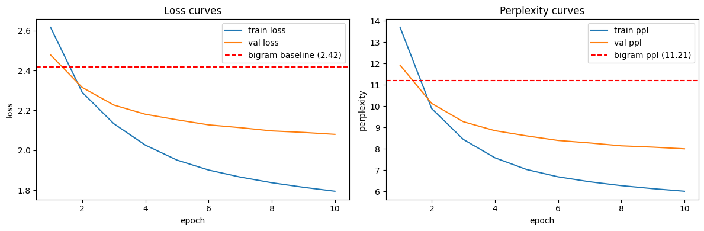
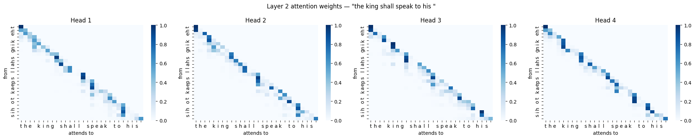

# Mini-GPT Decoder

A character-level GPT decoder built from scratch in TensorFlow, including manual implementation of masked multi-head self-attention, residual connections, and positional embeddings — trained on the TinyShakespeare dataset. The goal was to understand what a transformer decoder is actually doing, then verify that empirically against a bigram baseline.

---

## Architecture

```
Input (batch, 32) — character indices
    ↓
EmbeddingBlock — token embeddings + positional embeddings, summed
    ↓
GPTBlock × 2
    ├── SingleHead × 4 (scaled dot-product attention, causal mask)
    ├── MultiHeadAttention (concat + linear projection)
    ├── Dropout + LayerNorm (residual)
    └── Feedforward (Dense 256 → Dense 64) + Dropout + LayerNorm (residual)
    ↓
Dense(vocab_size) — logits, no softmax
```

| Hyperparameter | Value |
|---|---|
| Embedding dim | 64 |
| Number of heads | 4 |
| Head dim | 16 |
| GPT blocks | 2 |
| Sequence length | 32 |
| Dropout | 0.2 |
| Optimizer | Adam (lr=3e-4) |
| Batch size | 512 |

---

## Results

| Model | Val Loss | Val Perplexity |
|---|---|---|
| Bigram baseline | 2.42 | 11.21 |
| Mini-GPT (2 blocks, 10 epochs) | 2.08 | **8.00** |

Mini-GPT achieves **29% lower perplexity** than the bigram baseline, trained on 100k of 892k available sequences due to compute constraints (RTX 3050). The gap is expected to widen significantly with full data, the key result is the architectural advantage, not the absolute number.

### Why Mini-GPT beats bigram

A bigram model predicts the next character by looking at exactly one character back — it learns a 39×39 probability table of character co-occurrences and nothing more. Mini-GPT attends over the full 32-character context window simultaneously. At each position, the four attention heads learn to ask "which earlier characters are most relevant to predicting what comes next?" and aggregate their information via learned weighted sums. The perplexity gap is empirical evidence that context beyond a single character carries predictive signal — and that the attention mechanism successfully extracts it.

---

## Loss and perplexity curves

![Loss and perplexity curves]

Both train and val perplexity cross below the bigram baseline (11.21) by epoch 2, confirming the model learns meaningful structure quickly. The train/val gap indicates mild overfitting at this data scale — expected given 100k training sequences.

---

## Attention visualization

![Layer 2 attention weights]

Attention weights from Layer 2, input: `"the king shall speak to his "`.

Layer 2 shows clear head specialization — the four heads have learned distinct patterns:

- **Head 1** attends strongly along the diagonal with some diffusion to recent context — a local smoothing pattern
- **Head 2** shows sharp, sparse attention — focusing on specific high-information characters rather than spreading weight across the sequence
- **Head 3** attends more broadly across earlier context, suggesting it captures longer-range dependencies
- **Head 4** shows block-like structure that aligns with word boundaries — the model has implicitly learned that spaces delimit meaningful units, without ever being told what a word is

Layer 1 (not shown) shows uniform diagonal attention across all heads — a known pattern in shallow character-level models where one local attention pattern suffices for early feature extraction, and specialization emerges in deeper layers.

---

## Sample generation

Seed: `"the king "`, temperature: 0.8, length: 300 characters

```
the king ieffer: dow,
that you the thato would! cand to speack. send to my ther
affillow, bed your had to a bemary gear wromerp,
the bead the pay hee sent that your and my stay,
their.

sicinius:
peennce falourse, tare dangues for love but the be
the he were a would, and foorn,
whe forst offers, to the goods
```

The model has learned: space-delimited word structure, Shakespeare dialogue format (character name followed by colon), sentence-level punctuation, and approximate English phonotactics — all from raw character sequences with no linguistic supervision.

---

## Key implementation details

**Causal masking** — implemented as a lower-triangular mask added to attention scores before softmax, setting future positions to -1e9 to prevent the model from attending to tokens it hasn't generated yet:

```python
mask = tf.linalg.band_part(tf.ones((seq_length, seq_length)), -1, 0)
mask = (1 - mask) * -1e9
scores = scores + mask
```

**Attention weight extraction** — by implementing `SingleHead` manually and returning weights alongside outputs, every attention head's weight matrix is accessible at inference time for interpretability analysis.

**Scaffold for scaling** — the architecture is parameterized by `num_blocks` and `embed_dim`; scaling to GPT-2 small (12 blocks, 768 dim) requires only changing these values.

---

## Limitations and next steps

- Trained on 11% of available data due to GPU constraints as full training would push val perplexity toward ~4-5
- Head collapse in Layer 1 suggests the character-level task doesn't force specialization at shallow layers,  subword tokenization (BPE) would likely produce richer multi-head patterns
- Next: implement Byte Pair Encoding tokenizer, scale to 6 blocks, compare head specialization at word vs character level

---

## Setup

```bash
pip install tensorflow numpy matplotlib seaborn
```

Run `minigpt.ipynb` top to bottom. Tested on TensorFlow 2.x, Python 3.10.